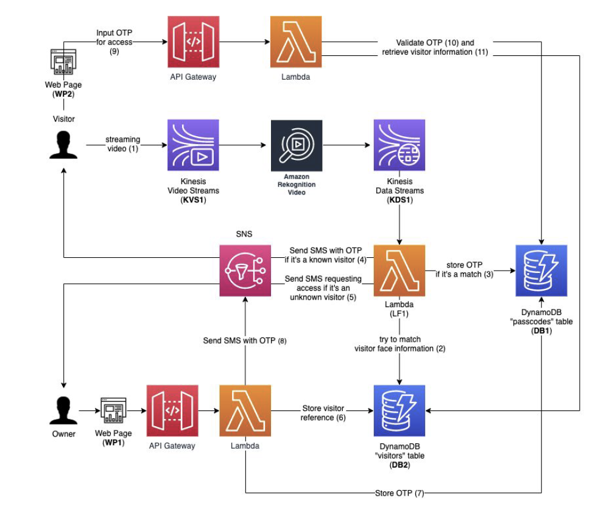

# Smart Door authentication system

**Goals**: 

 - For a given visitor, your system should be able to
   depict their face and email you to allow or deny them access.
 - If allowed access, you should be able to capture their information
   through a hosted web page. You should then send them an SMS message
   with a valid OTP that is only valid for a maximum of 5 minutes.
   
 - The OTP should be valid only once and guaranteed unique across the   
   different visitors.
 - For a returning visitor, your system should   
   automatically send them an SMS message with a valid OTP.
 - Given a valid OTP, a visitor should be able to input it and receive a
   personalized greeting.

## Setup

1. Visitor Vault
		 
a. Create a S3 bucket ( B1†) to store the photos of the visitors.

b. Create a DynamoDB table “passcodes” ( DB1†) that stores temporary access codes to your virtual door and a reference to the visitor it was assigned to
- Use the TTL feature1 of DynamoDB to expire the records after 5
	minutes.

c. Create a DynamoDB table “visitors” ( DB2†) that stores details about the
visitors that your Smart Door system is interacting with.

2. Analyze 

a. Create a Kinesis Video Stream3 ( KVS1†), that will be used to capture and
stream video for analysis. You can use the built-in video recording feature
in the Kinesis console to simulate a real streaming video camera.

b. Subscribe Rekognition Video4 to the Kinesis Video Stream (KVS1).

c. Output the Rekognition Video analysis to a Kinesis Data Stream (KDS1)
and trigger a Lambda function for every event that Rekognition
Video outputs.

3. Authorize 

a. Create a second web page, the “virtual door”, that prompts the user
to input the OTP. 
-	If the OTP is valid, greet the user by name and present a success
message.
-	If the OTP is invalid, present a “permission denied” message.

b. Note that you will have to build your own API to capture and validate the
OTP. 

## Architecture Diagram

